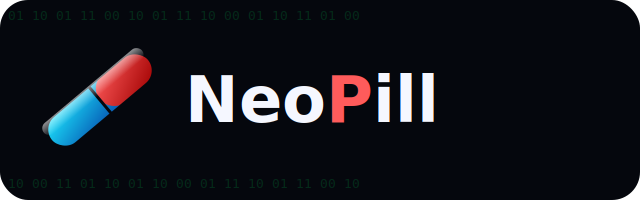

<p align="center">
  
</p>

<p align="center">
  <a href="https://buymeacoffee.com/bigurka"></a>
</p>

<p align="center">
  🇮🇹 <a href="#italiano">Italiano</a> · 🇬🇧 <a href="#english">English</a>
</p>

---

<a id="italiano"></a>

# NeoPill (Italiano)

Integrazione custom per Home Assistant (compatibile [HACS](https://hacs.xyz)) per la gestione dei farmaci
di uno o più pazienti: assunzioni, scorte, rifornimenti e promemoria dose, con un calendario nativo HA per
paziente e un dispositivo HA per ogni farmaco.

> Stato: v0.7.0, in sviluppo attivo. Le funzionalità descritte qui sotto sono tutte implementate; non ancora
> testata a fondo su un uso quotidiano reale (vedi [Stato del progetto](#stato-del-progetto)).

## Funzionalità

- Gestione multi-paziente. Ogni paziente ha un device hub **"‹Nome› NeoPill"** che raccoglie le entità
  trasversali (calendario, sensore farmaci-da-rifornire, pulsanti raggruppati per ora di assunzione) ed è
  il "genitore" (via_device) dei device dei suoi farmaci.
- Ogni farmaco è un dispositivo HA a sé, nominato `"‹Farmaco› (‹Paziente›)"`, con entità per scorta,
  prossima assunzione, giorni di scorta rimanenti, stato "da assumere" e stato "scorta in esaurimento". Due
  pazienti diversi con un farmaco dallo stesso nome restano completamente indipendenti (scorte, orari,
  storico separati, device ed entity_id distinti).
- **entity_id in inglese, stabili, sempre prefissati con il paziente** (prime 3 consonanti del nome, es.
  `mrr` per "Mario Rossi", con gestione automatica delle collisioni) — calcolati una sola volta alla
  creazione del paziente e stabili nel tempo anche se lo rinomini dopo, per non rompere
  automazioni/dashboard.
- **Nomi visualizzati e interfaccia del pannello localizzati**: i nomi delle entità ("Scorta", "Assumi
  ora", ...) e il pannello stesso seguono la lingua configurata in Home Assistant (italiano se
  `hass.language` è italiano, inglese altrimenti) — nessuna configurazione da fare, cambia da solo.
- Eliminando un paziente vengono rimossi automaticamente tutti i suoi farmaci, il calendario e le altre
  entità collegate (cancellazione a cascata tramite il device hub del paziente).
- Dosaggio a orari fissi al giorno, a giorni della settimana con orari indipendenti giorno per giorno (es.
  martedì e venerdì, con orari diversi tra loro), oppure a intervallo dall'ultima assunzione — con dose
  anche frazionaria (es. 1/2, 1/4).
- Rifornimento per quantità diretta o per numero di confezioni.
- **Pulsanti raggruppati per ora di assunzione**: per ogni orario in comune tra i farmaci di un paziente
  (orari fissi o giorni della settimana) vengono creati automaticamente due pulsanti — "Assumi tutti ore
  HH:MM" e "Segna tutti non assunti ore HH:MM" — che agiscono in un colpo solo su tutti i farmaci di quel
  paziente previsti a quell'orario. Creati/rimossi automaticamente quando aggiungi, modifichi o elimini un
  farmaco.
- **Finestra ideale di riordino, per paziente**: due soglie (giorni minimi/massimi, editabili dalla toolbar
  del pannello) pensate per raggruppare più farmaci possibile in un'unica commissione — minimi = non
  aspettare oltre (rischio di rimanere senza), massimi = non troppo presto (rischio di rifiuto del medico
  per prescrizione anticipata). Il sensore per paziente `sensor.‹slug›_restock_reminder` elenca i farmaci
  la cui stima di "giorni rimanenti" rientra in quella finestra, con un testo già formattato pronto per una
  notifica/email (vedi sotto) e, per ciascun farmaco, la data di esaurimento prevista.
- Tutta la gestione (pazienti, farmaci, assunzioni, rifornimenti) avviene da un pannello dedicato nella
  sidebar di Home Assistant, separato da Lovelace: i farmaci del paziente selezionato sono mostrati come
  tile in griglia, non come un semplice elenco.
- Servizi Home Assistant (`neopill.assumi_farmaco`, `neopill.segna_non_assunta`, `neopill.rifornisci_farmaco`)
  per l'uso da automazioni.

## Installazione

### Tramite HACS (repository personalizzata)

1. HACS → menu (⋮) → **Repository personalizzate** → aggiungi l'URL di questo repository, categoria
   "Integrazione".
2. Installa "NeoPill" dall'elenco HACS.
3. Riavvia Home Assistant.
4. Impostazioni → Dispositivi e servizi → Aggiungi integrazione → **NeoPill**.

### Manuale

Copia la cartella `custom_components/neopill` nella cartella `config/custom_components/` della tua
installazione Home Assistant, poi riavvia.

## Utilizzo

Dopo l'installazione, l'integrazione aggiunge una voce **NeoPill** nella sidebar. In alto nel pannello c'è
una toolbar (di dimensioni generose, ben leggibile) con: icona per aggiungere un paziente, selettore del
paziente attivo, i campi "Giorni minimi"/"Giorni massimi" della finestra di riordino di quel paziente (si
salvano da soli quando esci dal campo, con validazione), icona per rinominare il paziente, icona per
aggiungere un farmaco e icona per eliminare il paziente selezionato. Sotto, i farmaci del paziente come
tile in griglia, ciascuna con tutte le azioni quotidiane (assumi ora, segna come non assunta, rifornisci,
modifica, elimina) — disponibili anche come entità/servizi standard di Home Assistant.

## Promemoria rifornimento via email

NeoPill non gestisce l'invio di email direttamente (niente credenziali SMTP dentro l'integrazione): prepara
solo i dati, tramite un sensore per paziente `sensor.‹slug_paziente›_restock_reminder` (es.
`sensor.mrr_restock_reminder` per "Mario Rossi"). L'invio vero e proprio va fatto con un'automazione HA
che usa un servizio `notify.*` email già configurato (es. l'integrazione nativa `smtp`, oppure Gmail/altri).
Esempio (sostituisci l'entity_id con quello del tuo paziente):

```yaml
automation:
  - alias: "NeoPill - promemoria rifornimento farmaci"
    trigger:
      - platform: time
        at: "08:00:00"
    condition:
      - condition: numeric_state
        entity_id: sensor.mrr_restock_reminder
        above: 0
    action:
      - service: notify.smtp   # sostituisci con il tuo servizio notify email
        data:
          title: "NeoPill: farmaci da rifornire"
          message: "{{ state_attr('sensor.mrr_restock_reminder', 'testo') }}"
```

L'attributo `farmaci` del sensore contiene anche la lista strutturata (nome, giorni rimanenti, scorta, data
di esaurimento prevista) se preferisci costruire un messaggio personalizzato invece di usare il testo già
pronto. Se hai più pazienti, duplica l'automazione (o il trigger) per ciascun sensore.

## Permessi

Qualsiasi utente Home Assistant autenticato può registrare un'assunzione, una dose "non assunta" o un
rifornimento (dal pannello, da un pulsante o da un servizio). Solo gli utenti amministratori possono
creare, modificare o eliminare pazienti e farmaci.

## Sviluppo

Il pannello (`custom_components/neopill/panel_dist/`) è scritto in JavaScript nativo (Web Component, moduli
ES standard, nessuna dipendenza esterna): non è previsto alcuno step di build, i file in `panel_dist/` sono
i sorgenti stessi e vengono serviti così come sono. Le stringhe dell'interfaccia (IT/EN) sono in
`panel_dist/i18n.js` — per aggiungere una lingua basta un'altra voce nell'oggetto `STRINGS` e un caso in
più in `resolveLang()`. Allo stesso modo, i nomi delle entità sono in `strings.json`/`translations/*.json`
tramite il meccanismo nativo di traduzione di Home Assistant.

## Icona (brand)

L'icona/logo che compare in Impostazioni → Dispositivi e servizi viene letta da
`custom_components/neopill/brand/` (icon.png, icon@2x.png, logo.png, logo@2x.png) — funzionalità
disponibile da Home Assistant 2026.3 in poi, che permette a un'integrazione custom di fornire le proprie
immagini di brand senza passare da una PR al repository esterno `home-assistant/brands`. Su versioni di HA
precedenti alla 2026.3 questa cartella viene ignorata e resta il placeholder generico.

Le stesse immagini (più le versioni SVG sorgente `icon.svg`/`logo.svg`) sono presenti anche nella radice del
repository: servono per la scheda HACS e per il badge in cima a questo README, che sono cose distinte
dall'icona nella lista integrazioni.

## Stato del progetto

<a id="stato-del-progetto"></a>

v0.7.0: backend + pannello completi, con device/entity_id organizzati per paziente, entity_id inglesi e
nomi/interfaccia localizzati, schema settimanale, finestra di riordino per paziente e pannello in tile
(vedi Funzionalità). Non ancora testata a fondo su un uso quotidiano reale prolungato: prima di un uso in
produzione, verificare l'installazione secondo i passi in [Installazione](#installazione) e provare i
flussi principali (creazione paziente/farmaco, assunzione, rifornimento, promemoria dose, cancellazione
paziente) su un ambiente di test.

**Nota sui cambi di schema degli identificatori** (es. il passaggio a chiavi inglesi in v0.5.0): sono
puramente lato codice — al primo riavvio dopo un aggiornamento del genere, farmaci e pazienti già esistenti
ottengono automaticamente i nuovi entity_id/nomi, e le vecchie voci nel registro entità vengono ripulite in
automatico invece di restare "fantasmi" non disponibili. Fa eccezione lo slug del paziente (prime 3
consonanti), calcolato una sola volta alla creazione: per applicarlo a pazienti creati prima che esistesse,
serve ricrearli.

## Supporto

Se NeoPill ti è utile e vuoi offrirmi un caffè: [buymeacoffee.com/bigurka](https://buymeacoffee.com/bigurka).

## Licenza

MIT

---

<a id="english"></a>

# NeoPill (English)

A custom Home Assistant integration (compatible with [HACS](https://hacs.xyz)) for managing medications
for one or more patients: intakes, stock, restocks and dose reminders, with a native HA calendar per
patient and an HA device for each medication.

> Status: v0.7.0, actively developed. All features described below are implemented; not yet battle-tested
> on real day-to-day use over a long period (see [Project status](#project-status)).

## Features

- Multi-patient management. Each patient has a **"‹Name› NeoPill"** hub device that collects the
  cross-medication entities (calendar, restock-reminder sensor, per-time-slot group buttons) and is the
  via_device "parent" of that patient's medication devices.
- Each medication is its own HA device, named `"‹Medication› (‹Patient›)"`, with entities for stock, next
  dose, days of stock remaining, "dose due" state and "low stock" state. Two different patients with a
  medication of the same name stay completely independent (stock, schedule, history, device and entity_id
  are all distinct).
- **English, stable entity_ids, always prefixed with the patient** (first 3 consonants of the name, e.g.
  `mrr` for "Mario Rossi", with automatic collision handling) — computed once when the patient is created
  and stable over time even if you rename them later, so it never breaks automations/dashboards.
- **Localized display names and panel UI**: entity names ("Stock", "Take dose", ...) and the panel itself
  follow the language configured in Home Assistant (Italian if `hass.language` is Italian, English
  otherwise) — nothing to configure, it just follows along.
- Deleting a patient automatically removes all their medications, the calendar and any other linked
  entities (cascading delete via the patient's hub device).
- Dosing on fixed times per day, on specific days of the week with independent times per day (e.g. Tuesday
  and Friday, at different times), or on an interval since the last dose — with fractional doses supported
  too (e.g. 1/2, 1/4).
- Restocking by direct quantity or by number of packages.
- **Grouped per-time-slot buttons**: for every time shared by a patient's medications (whether from a
  fixed-times or a weekly schedule), two buttons are created automatically — "Take all at HH:MM" and "Mark
  all missed at HH:MM" — acting in one press on every medication of that patient scheduled at that exact
  time. Created/removed automatically as you add, edit or delete a medication.
- **Per-patient ideal reorder window**: two thresholds (min/max days, editable from the panel toolbar)
  meant to help you batch as many medications as possible into a single pharmacy trip — min = don't leave
  it any later (risk of running out), max = don't order too early (risk of the prescription being refused
  as premature). The per-patient sensor `sensor.‹slug›_restock_reminder` lists medications whose estimated
  "days remaining" falls inside that window, with a ready-to-send text for a notification/email (see
  below) and, for each medication, its predicted depletion date.
- All management (patients, medications, intakes, restocks) happens from a dedicated panel in the Home
  Assistant sidebar, separate from Lovelace: the selected patient's medications are shown as tiles in a
  grid, not a plain list.
- Home Assistant services (`neopill.assumi_farmaco`, `neopill.segna_non_assunta`,
  `neopill.rifornisci_farmaco`) for use in automations.

## Installation

### Via HACS (custom repository)

1. HACS → (⋮) menu → **Custom repositories** → add this repository's URL, category "Integration".
2. Install "NeoPill" from the HACS list.
3. Restart Home Assistant.
4. Settings → Devices & services → Add integration → **NeoPill**.

### Manual

Copy the `custom_components/neopill` folder into your Home Assistant `config/custom_components/` folder,
then restart.

## Usage

After installation, the integration adds a **NeoPill** entry to the sidebar. At the top of the panel there
is a (generously sized, easy to read) toolbar with: an icon to add a patient, the active-patient selector,
the "Min days"/"Max days" fields for that patient's reorder window (saved automatically on blur, with
validation), an icon to rename the patient, an icon to add a medication, and an icon to delete the
selected patient. Below, the patient's medications as tiles in a grid, each with all the everyday actions
(take dose, mark as missed, restock, edit, delete) — also available as standard Home Assistant
entities/services.

## Restock reminder via email

NeoPill doesn't send email itself (no SMTP credentials inside the integration): it only prepares the data,
via a per-patient sensor `sensor.‹patient_slug›_restock_reminder` (e.g. `sensor.mrr_restock_reminder` for
"Mario Rossi"). The actual sending has to be done with an HA automation using an already-configured email
`notify.*` service (e.g. the native `smtp` integration, or Gmail/others). Example (replace the entity_id
with your patient's):

```yaml
automation:
  - alias: "NeoPill - restock reminder"
    trigger:
      - platform: time
        at: "08:00:00"
    condition:
      - condition: numeric_state
        entity_id: sensor.mrr_restock_reminder
        above: 0
    action:
      - service: notify.smtp   # replace with your email notify service
        data:
          title: "NeoPill: medications to reorder"
          message: "{{ state_attr('sensor.mrr_restock_reminder', 'testo') }}"
```

The sensor's `farmaci` attribute also holds the structured list (name, days remaining, stock, predicted
depletion date) if you'd rather build a custom message instead of using the ready-made text. If you have
more than one patient, duplicate the automation (or its trigger) per sensor.

## Permissions

Any authenticated Home Assistant user can record an intake, a "missed" dose, or a restock (from the panel,
a button, or a service). Only admin users can create, edit or delete patients and medications.

## Development

The panel (`custom_components/neopill/panel_dist/`) is written in native JavaScript (Web Component, standard
ES modules, no external dependencies): there is no build step, the files under `panel_dist/` are the source
themselves and are served as-is. UI strings (it/en) live in `panel_dist/i18n.js` — adding a language is just
another entry in the `STRINGS` object plus a case in `resolveLang()`. Likewise, entity names live in
`strings.json`/`translations/*.json` via Home Assistant's native translation mechanism.

## Icon (brand)

The icon/logo shown under Settings → Devices & services is read from `custom_components/neopill/brand/`
(icon.png, icon@2x.png, logo.png, logo@2x.png) - a feature available from Home Assistant 2026.3 onward that
lets a custom integration ship its own brand images without a PR to the external `home-assistant/brands`
repository. On HA versions before 2026.3 that folder is ignored and the generic placeholder is used
instead.

The same images (plus the source SVGs `icon.svg`/`logo.svg`) also live at the repository root: they're used
for the HACS listing card and the badge at the top of this README, which are separate from the icon shown
in the integrations list.

## Project status

<a id="project-status"></a>

v0.7.0: backend and panel are feature-complete, with per-patient devices/entity_ids, English entity_ids
with localized names/UI, weekly scheduling, a per-patient reorder window, and a tiled panel layout (see
Features). Not yet battle-tested over extended real-world daily use: before relying on it in production,
verify the install following [Installation](#installation) and try the main flows (creating a
patient/medication, taking a dose, restocking, dose reminders, deleting a patient) in a test environment.

**A note on identifier-scheme changes** (e.g. the switch to English keys in v0.5.0): these are purely
code-side - on the first restart after such an update, existing medications and patients automatically get
the new entity_ids/names, and the old entity registry entries are cleaned up automatically instead of
lingering as unavailable "ghosts". The one exception is the patient slug (first 3 consonants), computed
once at creation time: to apply it to patients created before it existed, you need to recreate them.

## Support

If NeoPill is useful to you and you'd like to buy me a coffee: [buymeacoffee.com/bigurka](https://buymeacoffee.com/bigurka).

## License

MIT
